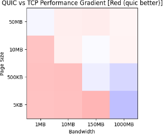
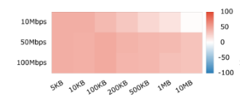
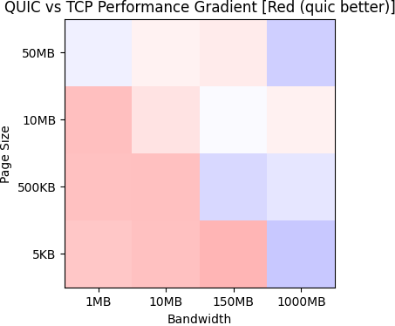
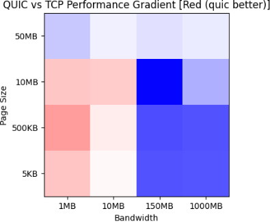
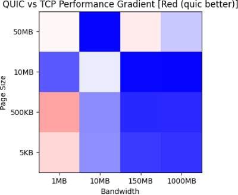
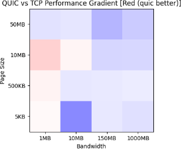
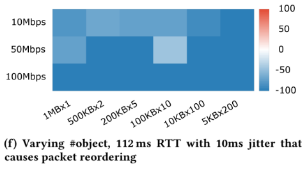
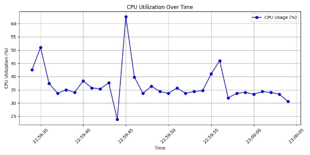
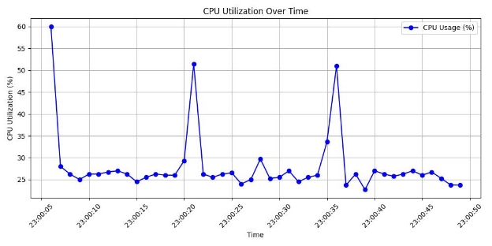

# **Objective:** 
The goal of this assignment is to perform experiments and analyze results to see the performance trade-offs between TCP and QUIC. As part of this assignment, you will perform experiments in terms of page load time (or file download time) of various file sizes and under various network bandwidths. 

**Setup:** The setup includes two Btech Lab machines connected using ethernet cable and supporting bandwidth upto 1Gbps. 

&nbsp; &nbsp; &nbsp; &nbsp; &nbsp;  &nbsp; &nbsp; &nbsp; &nbsp; &nbsp; &nbsp; &nbsp; &nbsp; &nbsp; &nbsp; &nbsp; &nbsp; &nbsp; &nbsp; &nbsp; &nbsp; &nbsp; &nbsp; &nbsp; &nbsp; &nbsp; &nbsp; &nbsp; &nbsp; &nbsp; &nbsp; &nbsp; &nbsp; &nbsp; &nbsp; &nbsp; &nbsp; &nbsp; &nbsp; &nbsp; &nbsp; &nbsp; &nbsp; &nbsp; &nbsp; 

&nbsp; &nbsp; &nbsp; &nbsp; &nbsp; &nbsp; 192.168.192.225 &nbsp; &nbsp; &nbsp; &nbsp; &nbsp; &nbsp; &nbsp; &nbsp; &nbsp; &nbsp; &nbsp; &nbsp; &nbsp; &nbsp; &nbsp; &nbsp; &nbsp; &nbsp; &nbsp; &nbsp; &nbsp; &nbsp; &nbsp; &nbsp; &nbsp; &nbsp; &nbsp; &nbsp; &nbsp; &nbsp; &nbsp; &nbsp; &nbsp; &nbsp; &nbsp; &nbsp; &nbsp; &nbsp; &nbsp; &nbsp; &nbsp; &nbsp; &nbsp; 192.168.192.235 

&nbsp; &nbsp; &nbsp; &nbsp; &nbsp; &nbsp; &nbsp; &nbsp; &nbsp; &nbsp; Client &nbsp; &nbsp; &nbsp; &nbsp; &nbsp; &nbsp; &nbsp; &nbsp; &nbsp; &nbsp; &nbsp; &nbsp; &nbsp; &nbsp; &nbsp; &nbsp; &nbsp; &nbsp; &nbsp; &nbsp; &nbsp; &nbsp; &nbsp; &nbsp; &nbsp; &nbsp; &nbsp; &nbsp; &nbsp; &nbsp; &nbsp; &nbsp; &nbsp; &nbsp; &nbsp; &nbsp; &nbsp; &nbsp; &nbsp; &nbsp; &nbsp; &nbsp; &nbsp; &nbsp; &nbsp; &nbsp; &nbsp; &nbsp; &nbsp; &nbsp; &nbsp; &nbsp;  Server    

Server runs two severs the chromium toy server for handling quic requests and apache2 server for handling tcp requests. Flow control, latency regulation and packet dropping is regulated using tc qdisc command such as :  

**sudo tc qdisc add dev eth0 root netem delay 100ms loss 5%** 

All these restrictions were applied on Server (for egress traffic)  

## **Part1:** 

Page load time (PLT) was used to estimate the performance of TCP and QUIC. Multiple files like: 

1) index\_5KB.html 
1) index\_500KB.html 
1) index\_10MB.html 
1) index\_50MB.html 

are hosted on both the servers and the client fetches the asked file.  

(To increase the size of the file a comment was added to the original index.html) Multiple bash and python scripts are used to accumulate the results here **selenium** is used and the page load time of each webpage is calculated, comment being in body correctly represents the estimated time. 

Results: 

 

### **Observations:** 

1) Quic performed better on the red areas that is areas where bandwidth was small 
1) Tcp performed better on blue areas where bandwidth was high 
1) On Large page sizes they tend to perform equally better but sometimes quic perform slightly better. 

### **Analysis:** 

Quic performs better on bandwidths that are relatively small or medium size, on the other hand Tcp performs better when bandwidth goes beyond and to 1000Mbps which is consistent with the results of the paper (Taking a long look at quic). 

## **Part2:** 

Part a: In this part use of the configurations obtained from the previous experiment and introduce losses, delays 

### **Losses: Loss 0.1%:**  

&nbsp; &nbsp; &nbsp; &nbsp; &nbsp; &nbsp; &nbsp; &nbsp; &nbsp; &nbsp; &nbsp; &nbsp; &nbsp; &nbsp; &nbsp; &nbsp; &nbsp; &nbsp; &nbsp; &nbsp; &nbsp; &nbsp; &nbsp; &nbsp; 

#### **Loss 7%:** 

&nbsp; &nbsp; &nbsp; &nbsp; &nbsp; &nbsp; &nbsp; &nbsp; &nbsp; &nbsp; &nbsp; &nbsp; &nbsp; &nbsp; &nbsp; &nbsp; &nbsp; &nbsp; &nbsp; &nbsp; &nbsp; &nbsp; &nbsp; &nbsp; 

#### **Loss 10%:** 

&nbsp; &nbsp; &nbsp; &nbsp; &nbsp; &nbsp; &nbsp; &nbsp; &nbsp; &nbsp; &nbsp; &nbsp; &nbsp; &nbsp; &nbsp; &nbsp; &nbsp; &nbsp; &nbsp; &nbsp; &nbsp; &nbsp; &nbsp; &nbsp; 

### **Reason:** 
As packet loss percentage increases tcp starts to perform better than quic because with increasing packet loss, TCP's mature and efficient retransmission and congestion control algorithms make it better suited to maintain reliable data transfer, whereas QUIC's performance may degrade due to its reliance on UDP and less optimized retransmission strategies. 

## **Part b:** 
With 112 ms RTT and with 10 ms jitter, that causes packet reordering. 

 

### **Reason:** 

TCP performs better than QUIC in this scenario because it ensures reliable, in-order packet delivery, which helps mitigate the effects of packet reordering caused by jitter. QUIC, while designed for low latency, struggles more with packet reordering and may suffer from inefficiencies under these conditions. 

## **Part 3:** 

In this part 700MB of html object size was fetched using 1000 Mbps bandwidth. Packets here are captured using wireshark and cpu utilization is plotted with time. 

CPU utilization of Quic (usr space) 

CPU utilization of TCP (usr space) 

Avg around 35 % 

Avg around 25% 

It is evident from the results that average utilization by Quic is much higher than tcp accounting for quic being an Application layer protocol. 
